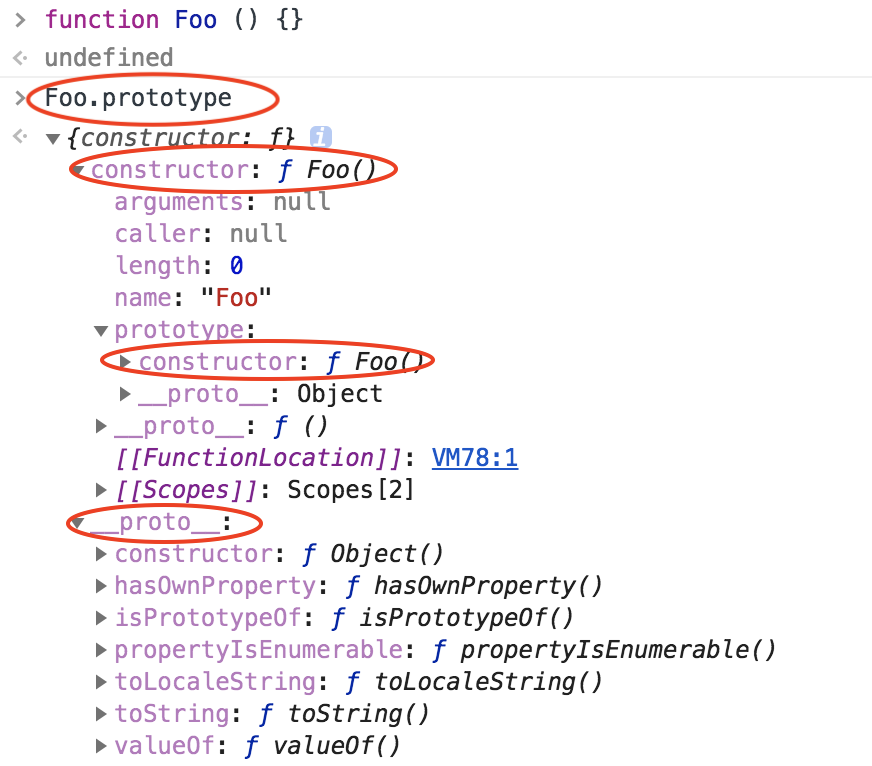
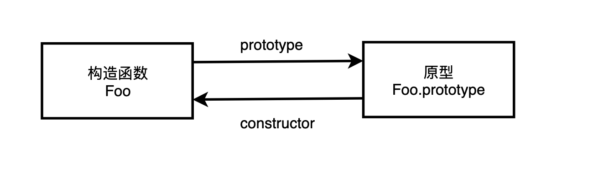
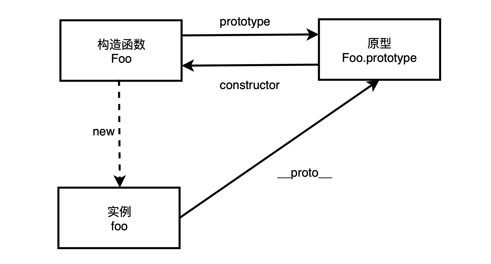
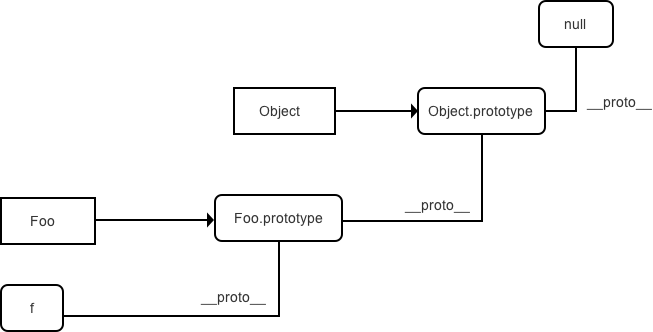

[toc]

## [深入 constructor、prototype、`__proto__`、[[Prototype\]] 及 原型链](https://github.com/sisterAn/blog/issues/5)

+ constructor

  每个实例都有一个 `constructor`（构造函数）属性，该属性指向对象本身。

  构造函数和普通函数的区别在于，使用 `new` 生成实例的函数就是构造函数，直接调用的就是普通函数。

  **对于引用类型来说 `constructor` 属性值是可以修改的，但是对于基本类型来说是只读的。**

+ 原型

  

  + `prototype`

    所有函数都有一个 `prototype` （显式原型）属性，属性值也是一个普通的对象。对象以其原型为模板，从原型继承方法和属性，这些属性和方法定义在对象的构造器函数的 `prototype` 属性上，而非对象实例本身。

    

    从上面这张图可以发现，`Foo` 对象有一个原型对象 `Foo.prototype`，其上有两个属性，分别是 `constructor` 和 `__proto__`，**其中 `__proto__` 已被弃用。**

    构造函数 `Foo` 有一个指向原型的指针，原型 `Foo.prototype` 有一个指向构造函数的指针 `Foo.prototype.constructor`，这就是一个**循环引用**，即：

    ```javascript
    Foo.prototype.constructor === Foo; // true
    ```

    

  + `__proto__`

    每个实例对象（object ）都有一个隐式原型属性（称之为 `__proto__` ）指向了创建该对象的构造函数的原型。也就时指向了函数的 `prototype` 属性。

    当 `new Foo()` 时，`__proto__` 被自动创建。并且

    ```javascript
    foo.__proto__ === Foo.prototype; // true
    ```

    即：

    [](https://user-images.githubusercontent.com/19721451/63651220-0893ea00-c785-11e9-80c7-1bb16494349a.png)

    `__proto__` 发音 dunder proto，最先被 Firefox使用，后来在 ES6 被列为 Javascript 的标准内建属性。

  + **new的实现过程**

    新生成一个对象

    链接到原型

    绑定this

    返回新对象

    ```javascript
    function new_object() {
      // 创建一个空的对象
      let obj = new Object()
      // 获得构造函数
      let Con = [].shift.call(arguments)
      // 链接到原型 （不推荐使用）
      obj.__proto__ = Con.prototype
      // 绑定 this，执行构造函数
      let result = Con.apply(obj, arguments)
      // 确保 new 出来的是个对象
      return typeof result === 'object' ? result : obj
    }
    ```

    ##### 优化 new 实现

    ```javascript
    // 优化后 new 实现
    function create() {
      // 1、获得构造函数，同时删除 arguments 中第一个参数
      Con = [].shift.call(arguments);
      // 2、创建一个空的对象并链接到原型，obj 可以访问构造函数原型中的属性
      let obj = Object.create(Con.prototype);
      // 3、绑定 this 实现继承，obj 可以访问到构造函数中的属性
      let ret = Con.apply(obj, arguments);
      // 4、优先返回构造函数返回的对象
      return ret instanceof Object ? ret : obj;
    };
    ```

    #### 总结

    - 所有的引用类型（数组、对象、函数）都有对象特性，即可自由扩展属性（null除外）。
    - 所有的引用类型，都有一个 `__proto__` 属性，属性值是一个普通的对象，该原型对象也有一个自己的原型对象(`__proto__`) ，层层向上直到一个对象的原型对象为 `null`。根据定义，`null` 没有原型，并作为这个**原型链** 中的最后一个环节。
    - 当试图得到一个对象的某个属性时，如果这个对象本身没有这个属性，那么会去它的 `__proto__` （即它的构造函数的 `prototype` ）中寻找。

  + 原型链

    每个对象拥有一个原型对象，通过 `__proto__` 指针指向上一个原型 ，并从中**继承方法和属性**，同时原型对象也可能拥有原型，这样一层一层，最终指向 `null`，这种关系被称为**原型链**(prototype chain)。根据定义，`null` 没有原型，并作为这个原型链中的最后一个环节。

    原型链的基本思想是利用原型，让一个引用类型继承另一个引用类型的属性及方法。

    ```javascript
    function func(name){
        this.name=name
    }
    
    let f=new func('test')
    
    f.__proto__===func.prototype	// true
    ```

    

## js加载

```javascript
window.onload = function(){
    //速度次之使用jQuery对象，页面加载完毕【DOM tree + 外部图片 + 资源】
    alert("页面加载完成====》onload");
}
$(window).load(function(){
    //速度次之使用DOM对象，页面加载完毕【DOM tree + 外部图片 + 资源】
    alert("jquery===》window load" ); 
})
$(function(){
    //速度并列第一，DOM结构加载完毕之后【浏览器把所有的HTML放入DOM tree之前就开始执行】
    alert("jquery====》document onload");
});
$(document).ready(function () {
    //速度并列第一，DOM结构加载完毕之后【浏览器把所有的HTML放入DOM tree之前就开始执行】
    alert("jquery====》document ready");
});

function aaa(){
    //速度最慢，一般绑定在<body onload="aaa()">等待body加载完成，就会执行aaa()方法。但是与window.onload方法冲突，会造成在后面的覆盖前面的。二者只能存在一个。
    alert("静态标签====》onload"); 
}
```

